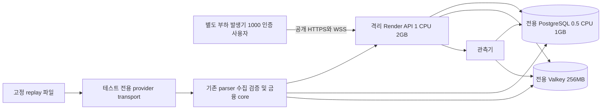

# Trading Class Render 동시 접속 1000명 부하 테스트 설계

현재 Render 사양에서 **인증된 WebSocket 1,000개와 실제 앱의 조회·거래 부하를 60분간 유지할 수 있는지 아직 판정할 수 없다.** 기존 측정은 로컬 환경의 일부 API와 작업에 한정되어 있다. 본 설계는 같은 사양의 격리된 Render 환경에서 5분 증가, 60분 유지, 5분 종료 시험을 수행하고, 이후 Lightsail에서 동일한 조건으로 비교할 수 있는 기준 기록을 만드는 계획이다.

이번 산출물은 조사와 설계다. 제품 코드·테스트·마이그레이션 변경, 운영 DB 접속, Render 리소스 변경, 배포, 유료 구매, 부하 테스트 실행은 하지 않았다. 확인한 원격 작업은 GitHub와 Render 제어 API의 읽기 전용 조회다.

## 1 조사 기준과 현재 배포

2026년 10월 11일 KST 조사 기준이다. Render 관측 원문 시각은 `2026-10-10T18:38:14Z`, 즉 10월 11일 03:38:14 KST다.

| 항목 | 확인 결과 |
|---|---|
| 저장소 | `windowsjd/trading_app`, 로컬 `main`, 시작 작업 트리 clean |
| 로컬 커밋 | `99192c94e7fb7d297d68dfc2b573ecf6a64e99b6` |
| GitHub 최신 main | `55cda476acc11f067814cf061320bc5c95f53319`, CI 안정화 PR 병합 |
| Render LIVE | 같은 `55cda476…`, 배포 `dep-db58b0qd0e5s73ei3uc0`, 완료 03:37:08 KST |
| API | `srv-da84cg8u01pc73cjasa0`, `1c-2g`, 1 CPU / 2GB, 인스턴스 1개, Singapore |
| PostgreSQL | `dpg-da7ac0e1egvs73e2sv20-a`, `0.5c-1g`, 0.5 CPU / 1GB, PostgreSQL 17, 디스크 5GB, HA 없음, 연결 풀 서비스 `none` |
| Valkey | `red-da7alead0e5s73dusbs0`, `256mb`, 8.1.4, `noeviction`, Journal + Snapshot |
| 추가로 존재하는 DB | `dpg-dattqaou01pc73agrsr0-a`, upgrade clone, 0.1 CPU / 256MB, PostgreSQL 17, 1GB, available |
| Workspace | Hobby는 사용자 제공 정보. owners API에는 요금제 필드가 없으므로 청구 화면을 확인한 사실로 표현하지 않는다 |
| 배포 방식 | `main` commit 자동 배포. build에서 Prisma generate 및 migrate deploy 실행, `node dist/src/main.js` 시작 |

GitHub와 로컬 사이 3개 커밋·31개 변경 파일을 대조했다. 금융 fixture 출처 교정, KOSCOM 내부 오류 경계, 캔들 HTTP 오류 표현, 지갑 오류 표시와 관련 검증이 주요 차이다. 주문·체결 아키텍처나 아래의 풀·WebSocket·작업 cadence가 바뀐 것으로 해석하지 않는다. 제품 분석은 로컬 소스에 최신 원격 patch를 대조한 결과다. 사용자 작업 트리를 checkout하거나 갱신하지 않았다. 근거는 [GitHub 변경 목록](evidence/github-current.json), [GitHub 비교](https://github.com/windowsjd/trading_app/compare/99192c94e7fb7d297d68dfc2b573ecf6a64e99b6...55cda476acc11f067814cf061320bc5c95f53319), [Render 설정 및 메트릭 접근 확인](evidence/render-current.json)이다.

### 운영 플래그와 요구 시나리오의 차이

현재 `LIMIT_ORDER_ENABLED=true`, `BINANCE_WEBSOCKET_STREAMING_ENABLED=true`, `KIS_WEBSOCKET_STREAMING_ENABLED=true`, `KOSCOM_POLLING_ENABLED=true`, `CANDLE_SERVING_MODE=database`다. FX 및 일일 snapshot scheduler, candle sync/reconciliation도 켜져 있다. 그러나 다음 기능은 현재 환경변수와 코드 기본값을 합치면 비활성 상태다.

| 기능 | 현재 상태 | 혼합 거래 시험의 격리 환경 |
|---|---|---|
| Spot 지정가 자동 매칭 | `SCHEDULER_LIMIT_ORDER_MATCHING_ENABLED` 미설정 → false. 지정가 생성 활성과 별개 | true |
| Futures 거래 | 관련 플래그 미설정 → `DISABLED` | `FUTURES_TRADING_MODE=ENABLED` |
| Futures Mark 및 Last 수집과 위험 검사 | 미설정 → false | Mark, Last ingestion 및 risk engine 모두 true |
| 조건부 주문 생성 | `CONDITIONAL_ORDERS_ENABLED` 미설정 → false | true |
| Live candle streaming | `CANDLE_LIVE_STREAMING_ENABLED=false`, Binance live도 false | streaming 및 Binance live true, 기존 reconciliation 유지 |
| Candle Redis cache | `CANDLE_CACHE_ENABLED` 미설정 → false | 첫 기준 기록에서도 false. cache 활성 결과는 별도 시험 |

따라서 **주 시험은 현재 하드웨어 사양에 요구 기능을 켠 `혼합 거래` 기준 기록**으로 명명한다. 운영 플래그 그대로의 `현재 운영 설정` 결과도 별도로 남긴다. 후자의 disabled 응답·live candle 부재를 정상 상태로 검증할 수 있지만 선물 체결이나 live candle 성능을 통과했다고 주장할 수 없다. 두 기록의 feature manifest를 분리하고, 각각 같은 manifest로 Lightsail과 비교한다. 운영의 선물·매칭·조건부 기능을 활성화하는 작업은 이 설계에 포함하지 않는다.

## 2 코드 분석과 병목 후보

### HTTP 호출과 화면 수명

| 앱 동작 | 실제 호출과 빈도 | 부하 모델에 반영할 사항 |
|---|---|---|
| 마켓 목록 | `/api/v1/assets?withPrice=true&limit=20…`, infinite query. 다음 페이지는 서버의 `sortSnapshot` 유지. 고정 REST polling 없음 | 최초 진입·재진입·스크롤·pull refresh에만 호출. 매초 목록 HTTP 조회를 만들지 않는다 |
| 마켓 실시간 | 로드된 행 전체의 `asset_ticker` 구독. 화면에 보이는 행만 구독하는 구조가 아님 | 기본 20종목, 페이지 추가 시 40개 등. crypto는 실제 25개 universe 한도 반영 |
| 종목 차트 | `/assets/:id`, `/assets/:id/candles?range=…&interval=…&limit=…`, ticker/candle 구독 | 진입·timeframe 변경·재연결 resync에 HTTP 조회. 정상 연결 중 REST candle polling 없음 |
| 호가 | `asset_order_book` WebSocket, 현재 Binance crypto 매핑 대상 | 별도 HTTP 호가 polling을 추가하지 않는다. 주식 호가를 이 채널로 지원한다고 가정하지 않는다 |
| Home·지갑·포트폴리오 | 현재 화면은 account-scoped `/trading-accounts/:id/portfolio`, positions preview/full, wallets, 필요 시 equity 조합. Home에는 `/me`, 시즌 ranking limit=1, 인기 assets limit=5도 있음 | legacy `/home`만 반복하는 부하로 대체하지 않는다. equity와 전체 holdings는 펼친 경우에만 읽고 인기 종목 category 이동·시즌 문맥 조회도 포함 |
| Spot 주문 패널 | asset, account fee, positions, BUY wallets, 필요 시 protections; quote 후 create | 같은 계정·query key의 cache와 중복 조회 제거, 성공 후 활성 observer의 invalidation 조회 반영 |
| Futures 목록 | account-scoped `/futures/instruments` 5초마다, focused 조건 | 목록에 머무른 동안만 0.2 req/s |
| Futures 상세 | `/futures/instruments`와 `/futures/positions` 각각 2초마다, focused 조건. history·final settlement는 진입 조회 | 상세 사용자 1명당 약 1 req/s. 전체 목록을 계속 조회하며 선택 상품 하나만 조회하는 API로 대체하지 않는다 |
| 주문 기록 | `/orders?limit=20…`, focused·foreground이고 submitted limit가 있을 때 4초 polling | 모든 기록 사용자를 무조건 4초 polling하지 않는다 |
| FX | `/fx/rates/current`, `fx_rate` invalidation 후 refetch, 5분 fallback 및 validUntil 경계 | 값이 없는 WS 알림을 환율 값으로 처리하지 않는다. burst resync도 기존 coalescing과 동일하게 실행 |
| Wallet Transfer | Futures에서 나가는 경우 collateral 5초 polling | 소수의 실제 이체 화면 사용자에게만 적용 |

공통 query 기본값은 staleTime 5초, 조회 retry 1회, mutation retry 0회, window focus refetch false다. 계정 context의 `/me`는 staleTime 60초, 계정 목록은 30초이며 고정 polling이 아니다. portfolio는 알려진 일시적 장애만 1회 retry하는 별도 정책이 있다. HTTP timeout은 10초다. 1초 clock UI timer를 서버 요청 빈도로 세지 않는다.

`MarketScreen`은 focus 조건 없이 구독을 유지한다. React Navigation에 화면이 남아 있으면 종목 상세·다른 탭 이동 후에도 이전 목록 구독이 남을 수 있다. 반면 차트·Futures 상세 조회는 focus 조건이 있다. 구현 전 작은 화면 이동 trace로 mount/unmount와 실제 활성 observer를 확인하고, **백그라운드에 남는 목록 구독을 임의 해제해 부하를 줄이지 않는다.**

근거: [마켓](../../../frontend/src/screens/market/MarketScreen.tsx), [차트](../../../frontend/src/screens/asset/AssetChartScreen.tsx), [선물 상세](../../../frontend/src/screens/futures/FuturesScreen.tsx), [기록](../../../frontend/src/screens/history/TradeHistoryScreen.tsx), [앱 query 설정](../../../frontend/src/app/AppProviders.tsx), [FX 동기화](../../../frontend/src/features/wallet/fxRateUpdates.ts), [포트폴리오 retry 정책](../../../frontend/src/features/tradingAccount/portfolioReadPolicy.ts).

### WebSocket 인증과 배포 경로

실제 프로토콜은 Nest `WsAdapter`와 raw WebSocket이며 Socket.IO가 아니다. 앱 세션당 공유 연결 하나가 `/api/v1/ws?token=…`에서 `asset_ticker`, `asset_candle`, `asset_order_book`, `fx_rate`를 운반한다. `subscribe`/`unsubscribe` 메시지, ACK, candle interval, book sequence를 그대로 사용한다. 참조 수가 0이면 연결을 닫는다. 재연결은 1·2·5·10·30초 backoff, 새 token 로딩, 재구독, candle HTTP baseline 복구다. 인증 실패 1008/UNAUTHORIZED는 자동 재연결을 중단한다.

서버는 연결마다 JWT를 확인하고 PostgreSQL에서 active user를 조회한다. HTTP 보호 API도 JWT 검증 및 user 조회를 수행한다. 별도 dummy header로 `req.user`를 넣거나 JWT를 자체 발급하는 부하 발생기는 사용하지 않는다. JWT TTL은 현재 15분, refresh TTL은 7일이므로 60분 시험에 정상 refresh와 rotating session 저장 비용을 포함한다. 이미 열린 WS를 token 만료 시 강제 재인증하는 동작을 새로 추가하지 않는다. 재연결 시에는 당시의 유효 token을 사용한다.

기존 gateway의 3초 snapshot poll은 구독 종목을 모아 종목별로 읽은 후 공유한다. 1,000명 × 종목마다 별도 polling하는 구조가 아니다. event fanout은 각 이벤트에서 client map을 순회하고 각 수신자에게 JSON을 보낸다. 정적 자산 metadata에는 5분 cache와 concurrent miss 병합, 실시간 FX 변환에는 2초 cache, 전일 대비 계산에는 30초 cache와 single-flight가 있다. 이 개선을 무시하고 모든 tick이 동일한 DB 조회를 발생시킨다고 가정하지 않는다.

Backpressure는 기본 `bufferedAmount > 1MiB`에서 최신 ticker/candle/book/FX 상태를 모아 100ms timer로 재전송한다. ticker pending은 자산별 최신값이며 client당 64개 한도다. candle·book 구독 한도는 각각 기본 20개다. ticker의 `coalesced`는 큐에 넣은 횟수이고, `dropped`는 큐 축출 외에 전달 시점의 주식 session 거부도 포함한다. candle sequence/revision, book sequence가 오래된 이벤트를 거부한다. 모든 중간 tick 보존을 합격 조건으로 삼지 않는다.

`GET /readiness`에는 현재 ticker `clients/sent/coalesced/dropped/pending`이 있다. 이 endpoint는 현재 public이다. 여기에 계정별 자료, SQL, 세션·token 정보를 추가하지 않는다. candle/book/FX의 동일한 전송·병합·drop 상세 계수, 전송 bytes, 이벤트 지연 histogram은 별도 관측 보완이 필요하다. 근거: [공유 WS manager](../../../frontend/src/services/ws/realtimeSocketManager.ts), [gateway](../../../backend/src/realtime/asset-ticker.gateway.ts), [readiness](../../../backend/src/app.service.ts), [HTTP 인증](../../../backend/src/auth/access-token.guard.ts).

### 거래와 백그라운드 작업

Spot은 durable quote → `POST /trading-accounts/:id/orders`로 생성·체결한다. quote fee pin, 재가격 결정과 maxChangeBps, 예약금·수량, 지갑 scope, 시즌·계정·소유권 검증, 원장과 Position의 원자적 변경을 유지한다. 신규 quote를 만들기 전 같은 요청의 불확실한 결과를 기존 idempotency key로 재확인한다.

Futures Market은 별도의 quote API 없이 `/futures/execute` 명령을 사용한다. 거래 가격은 **Futures Last**, Mark는 평가·담보·청산이다. Spot Last나 Mark로 Futures execution을 대신하지 않는다. Last의 receipt freshness 10초·trade age 60초, Mark의 두 시각 freshness 5초와 미래값 거부를 유지한다. Isolated/Cross, 1~100 leverage와 lifetime 고정, MMR 0.5%, 수수료·bankruptcy evidence·전량청산은 기존 core가 계산한다. Limit·조건부 exit도 existing execution core로 들어간다.

| 작업 | 실제 구현 | 병목 가설과 측정 |
|---|---|---|
| Spot limit | 기본 5초, cycle fill budget 200, bounded candidate scan, 최신 snapshot Path A 및 닫힌 5분 candle Path B | 미충족 주문 누적, scan/batch 소진, 실제 기준 충족→commit 지연. HTTP accepted와 체결 완료를 구분 |
| Futures limit | 1초, 최대 200개, cursor, 비중첩, 순차 evaluate | 한 cycle이 1초를 넘으면 간격 확대. 미충족 상태도 조회·lease 비용 발생 |
| 조건부 | 1초, 최대 100 group, cursor, 순차 evaluate | SL/TP/OCO 검사, trigger→execution 지연, lease 갱신, cleanup |
| 위험·청산 | 1초, 최대 250 account, 동시 8, account 내 scope 순서 유지 | 사용자 read/write와 같은 PG pool 공유, 전체 account 재방문 시간과 위험 감지→commit |
| 가격 보존·수집 | Last/Mark 1초 cycle, 최신값 병합·중복 방지, retention | 상품 수에 따른 PG insert/WAL, retention 및 조회와 경합 |
| 시즌 거래 후 랭킹 | Spot 주문·limit fill 뒤 비동기 refresh. 요청은 시즌별로 병합하고 처리 중 새 요청은 후속 계산 | 특정 participant ID만 재평가하는 구현이 아니라 시즌의 rankable participant를 계산하고 Season write lock 아래 publication. 랭킹 scheduler OFF도 이 거래 후 작업을 끄지 않음 |
| 일일 집계·랭킹·시즌·캔들 | Ops scheduler와 BatchJob 기반, 플래그 및 시각 조건 | baseline 중 예정된 작업은 유지·기록. 종료·정산·대형 batch는 별도 시험 |

Futures limit와 conditional worker는 사용자 기능 OFF에서도 lifecycle cleanup을 위해 polling한다. OFF를 DB 작업 0으로 해석하지 않는다. 금융 작업의 분산 권위는 PostgreSQL `OpsJobLock` lease다. Redis lock으로 주문 매칭을 옮기지 않는다. 근거: [Spot matching 설정](../../../backend/src/orders/limit-order-matching.config.ts), [매칭 서비스](../../../backend/src/orders/limit-order-matching.service.ts), [Futures limit worker](../../../backend/src/futures/futures-limit-worker.service.ts), [conditional worker](../../../backend/src/conditional/conditional-worker.service.ts), [risk worker](../../../backend/src/futures/futures-risk-worker.service.ts), [랭킹 refresh](../../../backend/src/ranking/ranking-refresh.service.ts), [Futures 계약](../../../backend/docs/futures-api-contract.md), [Last 정책](../../../backend/docs/futures-last-price-contract.md).

### PostgreSQL과 Valkey

`PrismaService`는 Prisma 7 `PrismaPg` adapter를 사용하며 connectionString만 넘긴다. 현재 설치된 `pg` 기본 pool max는 10이고, Render PgBouncer는 `none`이다. 연결 1,000개가 PG 연결 1,000개를 의미하지 않는다. 부하 발생기·DB observer의 연결은 이 10개와 구분하고 별도 상한을 둔다.

quote/authorization/order/Wallet/Position lock 순서와 lock 이후 `clock_timestamp()` 재검증을 유지한다. 시즌 금융 쓰기는 Season → Account → Participant authorization, 금융 wallet·position lock 순서가 있다. 일반·초보 계정은 시즌 participant가 없어야 한다. Futures positions는 `RepeatableRead` transaction에서 Last/Mark와 Cross collateral을 계산한다. transaction 안에서의 `Promise.all`을 여러 독립 PG 연결로 처리된다고 해석하지 않는다.

Futures catalog는 이미 전체 상품의 Last/Mark를 2개 indexed query로 묶어 읽는다. 여기에 과거의 상품별 catalog 조회 병목을 다시 가정하지 않는다. 다만 positions의 포지션별 가격·위험 조회, account authorization, wallet·원장·거래 조회 및 offset pagination 비용이 남는다. 실제 SQL 수는 보유 포지션 수·mode별로 측정한다.

Valkey는 candle cache·single-flight, public market sort snapshot, transient Pub/Sub, provider 수집 lease, Binance REST cooldown/weight budget, KIS shared rate limit·OAuth coordination에 쓰인다. 거래 잔고·원장·체결의 Source of Truth로 쓰지 않는다. 시장 목록의 sort cache는 첫 페이지 2초 재사용, pagination token 600초, 최대 200 snapshot이다. Pub/Sub 채널은 고정 이름이므로 DB 번호만 나눠 같은 Valkey를 쓰면 격리되지 않는다.

현재 `noeviction`이므로 메모리 부족 시 write 오류가 발생할 수 있다. 1,000명 WS가 Valkey client 1,000개를 만드는 구조는 아니며, 서버의 공용 command/subscriber 연결을 계측한다. 공식 최신 가격표의 256MB 연결 한도는 200, compute-plans 문서 snapshot은 250으로 서로 다르다. 계획에는 보수적으로 200을 적용하고 격리 인스턴스의 실제 `INFO maxclients`를 확인한다. [가격 발췌](evidence/pricing-excerpts.json), [Render compute 문서](https://render.com/docs/compute-plans).

Binance REST는 shared Redis admission, 동시 2, 기본 weight budget 600/min, 429/418 cooldown과 recovery probe를 유지한다. KIS는 기본 real REST 125ms, OAuth 1,000ms, bounded queue/wait 및 앱키별 shared coordination을 유지한다. **현재 국내주식 provider는 KOSCOM이고 KIS는 미국주식 경로**다. KOSCOM transport도 replay 대상에 포함한다. 과거 KIS 국내주식 설계는 현재 코드에 적용하지 않는다.

근거: [Prisma](../../../backend/src/prisma/prisma.service.ts), [Futures read](../../../backend/src/futures/futures.service.ts), [catalog batch read](../../../backend/src/futures/futures-reference-prices.ts), [금융 lock 계약](../../../backend/docs/orders-api-contract.md), [sort cache](../../../backend/src/assets/asset-sort-snapshot-cache.ts), [Binance 제한](../../../backend/src/providers/binance/binance-rest-coordinator.ts), [KIS 제한](../../../backend/src/providers/kis/coordination/kis-rate-limit.config.ts), [현행 provider 정책](../../../backend/docs/policy-decisions.md).

### 병목 우선순위

1. **선물 HTTP와 PG 풀 대기.** Futures 상세 150명은 두 API만 약 150 req/s다. 과거 fixture의 catalog 8 SQL, positions 31 SQL을 적용하면 약 2,925 SQL/s이며 정상 HTTP 인증의 user query, 다른 화면, ingestion·worker가 추가된다. 이 값은 해당 fixture의 산술 예측이며 현재 환경의 실측이 아니다.
2. **WS 전송 CPU와 네트워크.** client 순회, 수신자별 serialize/send, 이전 마켓 화면의 다종목 구독 유지가 1 CPU를 압박할 수 있다. RSS, event loop lag, bytes와 실제 구독 분포를 함께 봐야 한다.
3. **금융 lock과 worker 재방문 지연.** 같은 계정의 사용자 명령·conditional·risk가 같은 wallet 경계에서 경쟁한다. 사용자 간 지갑을 공유하는 비현실적인 fixture는 피한다.
4. **시즌 거래 후 랭킹 publication.** 시즌 250명은 거래가 적어도 공동 랭킹 계산과 Season write lock 비용을 만들 수 있다. refresh를 시험에서 제외하거나 scheduler OFF만으로 제거됐다고 판단하지 않는다. trigger→publication 지연, 병합·후속 refresh 횟수와 시즌 주문의 lock 대기를 별도로 측정한다.
5. **시세 저장·차트·cache의 경쟁.** Last/Mark 누적, 5GB DB 디스크/WAL, 차트 읽기·bounded repair, 256MB noeviction 및 Pub/Sub 장애가 병목 후보다. cache OFF 기준 결과에 cache ON 개선치를 섞지 않는다.

## 3 기존 기록의 의미와 재사용 범위

| 기존 자료 | 재사용 | 이번 합격 근거로 사용할 수 없는 범위 |
|---|---|---|
| `futures-read-api-benchmark.ts` | endpoint timing, PG statement delta, 환경 manifest, pool 증가 시 PG PID 재발견 방식 | fixture header가 인증을 대체하고 loopback DB만 허용. 정상 JWT/로그인·WS·인터넷 RTT 및 1,000 사용자 시험이 아님 |
| `futures-performance-benchmark.ts`, `futures-risk-benchmark.ts` | 매칭·위험 sweep/revisit, 실제 PG 경합·core 및 정합성 assertion | 서비스 수준·로컬 사양의 제한된 시나리오. Render 전체 앱 용량과 다름 |
| `candle-release-fixture-smoke.ts` | provider fixture, live socket factory, parser·overlay·Redis·PG 경로 및 증거 기록 | 최신 원격 수정 반영 필요. 1,000 authenticated client로 확장한 구현이 필요 |
| `asset-candle-fanout.performance.spec.ts` | backpressure·최신값·cleanup 회귀 | fake socket 단위 시험이며 TLS·커널·네트워크 수신 비용 제외 |
| 실제 PG 금융 integration 및 CI | idempotency, fee pinning, 예약금, limit/cancel race, SL/TP/OCO, Mark/Last·청산·시즌·초보 계정 검증 규칙 | 부하 발생기의 인증 우회 fixture를 원격 baseline에 그대로 사용하지 않음 |
| `futures-collection-soak.ts` | monotonic duration, clock-step 감지, interrupted/failed 상태, JSONL·resource 요약 | 실제 Binance 호출을 하는 수집 soak. 이번 기본 시험에서는 실행하지 않음 |

기존 [API 기록](../2026-10-10-futures-last-price-followup/report.md)의 C=50은 50 소유자, 23상품, 계정당 Cross 포지션 2개, 각 12초였다. 약 325 req/s, catalog p95 190ms, positions p95 163ms, Node 약 101% one-core, PG backend CPU 약 75% one-core가 기록되어 있다. JWT·인터넷 RTT는 제외했고 다른 soak도 같은 로컬 PG host에서 실행 중이었다. **0.5 CPU Render DB에서 같은 수치가 나온다는 뜻이 아니다.**

[Futures Last 매칭 원본](../2026-10-10-futures-last-price/evidence/benchmark-futures-last.json)은 1,000 pending·10% fillable에서 first sweep 약 9.87초, fill p95 약 9.84초이고, 전부 fillable인 별도 스트레스는 fill p95 약 36.54초다. 따라서 주문 API 2초 목표를 모든 지정가의 체결 완료 목표로 적용하면 정책·실측과 충돌한다.

IDE에 열린 [최종 24h 파일](../2026-10-10-futures-last-price-followup/evidence/soak-24h-final/soak-24h.json)은 `INTERRUPTED`, elapsed 31,975.96초, `actual24hCompleted=false`다. `badFreshSamples=1`, 계획하지 않은 금융 오류 없음 assertion과 clock-step 없음 assertion도 false다. 약 8.88시간 수집 기록으로만 취급하며 24시간 PASS나 1,000명 baseline으로 사용하지 않는다. WSL 시계 역행 조사를 반영해 기본 발생기는 동기화가 검증된 cloud Linux로 선정한다.

## 4 기본 시나리오와 부하 계산

### 사용자와 행동 분포

1,000개의 서로 다른 active user와 소유 계정을 사용한다. 기준 계정 분포는 일반 600·시즌 250·초보 150이며 행동 분포와 독립적으로 배정한다. 시즌은 시험 시작부터 종료·검증까지 active/참가 상태를 유지하는 전용 시즌이다. 계정·상품의 capability가 허용한 작업만 정상 행동으로 선택한다. 거래 이력에서 얻은 운영 비율이 없으므로 아래 비율은 **코드에 근거한 초기 제품 가정**이며 승인 manifest에 고정한다.

| 주로 머무는 상태 | 목표 점유율 | 평균 행동과 대기 |
|---|---:|---|
| 현물 마켓 탐색 | 30% / 약 300명 | 30~90초 체류. 첫 20개, 방문 중 20%는 추가 페이지, pull refresh는 1~3분 간격. 정렬·검색 소수 |
| 종목·차트·호가 | 25% / 약 250명 | 30~60초 체류. ticker 1·live interval 1·지원 crypto book 1 추가. 방문 중 20% timeframe 변경 |
| Spot 주문 입력 | 10% / 약 100명 | 입력 5~20초, 유효 quote 표시 후 1~3초에 제출. 사용자당 주문 의도 60~180초 간격, 기본 평균 120초 |
| Futures 상세 | 15% / 약 150명 | 2초 read 2개 유지. 30%가 120~240초 간격 명령, 평균 180초. history 조회·상품 이동은 30~90초 간격 |
| Home·지갑·포트폴리오 | 15% / 약 150명 | 45~120초 체류. 30% 추이 펼침, 소수 전체 holdings/다음 페이지·refresh |
| 주문 기록·FX | 5% / 약 50명 | 30명 기록, 20명 FX를 초기값으로 배정. 기록 중 pending 있는 비율 30%. FX fallback·invalidation과 소수 이체 반영 |

고정된 1,000명이 각 상태에 붙어 있는 구현 대신, seed가 고정된 행동 sequence와 dwell time으로 화면을 이동한다. 사용자 profile별 체류 시간을 조정해 60분 동안 위 점유율에 근접하게 만들고 실제 1초·1분별 점유율을 보고한다. Think time 중에도 WS receive loop는 계속 동작한다. 정상 read는 query별 in-flight 중복을 제거하며 느린 응답 뒤에 밀린 polling을 한꺼번에 발사하지 않는다.

Spot 의도는 market 70%·limit 30%, BUY 60%·SELL 40%로 시작한다. SELL은 실제 보유 수량 범위다. Futures 의도는 market 70%·limit 30%, market operation은 open/increase 40%·reduce/close 60%, Isolated 70%·Cross 30%로 시작하며 포지션 상태에 맞게 선택한다. 정상 leverage는 2·5·10배 위주다. 법칙·수수료를 변경하지 않는다.

Spot/Futures 전체 limit 의도 중 20%는 20~120초 뒤 사용자 취소, 보호 설정 가능한 새 진입 중 10%는 기존 SL/TP 또는 OCO를 부착한다. 기준 시장 경로는 매 5분 동안 pending의 약 10%에 순차적으로 도달하게 만들고, 모든 계정의 모든 주문을 동시에 체결시키지 않는다. liquidation은 초기 포지션 상태가 동일하지 않은 소수 계정, 시간차를 둔 약 1% account에서 기존 조건을 실제 만족시켜 발생시킨다. 이 수치들의 실제 achieved count도 보고한다.

인기 선택은 상위 5종목 60%·나머지 40%로 시작하되 첫 마켓 페이지에 공통 종목이 많이 나타나는 실제 정렬을 유지한다. 기본 주문은 24시간 crypto로 구성해 cloud 비교에서 동일한 market-open 조건을 확보하고 주식은 조회에 포함한다. KRX/KIS 미국주식의 실제 개장 시간 거래는 별도 변형이다. 주말에 주식 거래를 가능하게 하거나 market calendar·timestamp 검증을 우회하지 않는다.

### 1000개 연결의 정의

5분 동안 약 3.33명/초로 분산 연결하고, 마지막 사용자 연결·구독 ACK 이후 60분을 측정한다. 이 60분은 ramp 시간을 포함하지 않는다. `101`/open만으로 인증 성공으로 세지 않고 정상 채널 ACK와 서버 client count를 확인한다. 사용자별 WS 1개다.

원래 앱은 구독이 없어지면 연결을 닫고, Futures 시장 선택은 기존 spot 목록 구독을 해제할 수 있다. 사용자가 요구한 **모든 사용자의 1,000 WS 유지**를 검증하기 위해 주 시험은 각 사용자에게 기존 프로토콜의 최소 ticker 1개를 유지한다. 원래 목록이 남는 경우 20개 이상을 그대로 유지하며 추가 1개를 중복 구독하지 않는다. 이 최소 구독 유지 조건은 앱이 자연스럽게 연결을 닫는 화면보다 부하가 큰 명시적 시험 조건이다. 실제 앱의 해제 규칙을 그대로 적용한 연결 수 결과는 보조 시나리오로 분리하고, 그 결과로 1,000 WS 통과를 대신하지 않는다.

### 예상 HTTP 및 네트워크

Futures 상세 150 × (instruments 0.5 + positions 0.5) = **150 req/s**가 주요 고정 부하다. Spot 의도는 100/120 ≈ 0.83/s, quote+create ≈ 1.67 req/s이며 활성 화면의 성공 후 refetch가 추가된다. Futures 명령은 150 × 0.3/180 ≈ 0.25/s다. 기록 polling은 30 × 0.3/4 = 2.25 req/s다. 마켓·차트 진입·지갑·history·invalidation을 합친 초기 유지 구간의 계획 범위는 **약 180~220 HTTP req/s**다. 이는 측정값이나 서버 처리 능력 보장이 아니다.

초기 마켓 방문 후 구독이 남으면 foreground 비율만으로 계산한 6,000~10,000개보다 실제 ticker 구독은 17,000~20,000개에 가까울 수 있다. 구현 trace에서 구독 분포를 확정하고 JSON manifest에 넣는다. 예를 들어 17,000 ticker/s × 평균 JSON 650B면 11.05MB/s다. 250명 book × 2/s × 1,400B = 0.70MB/s, candle 250 × 1/s × 650B = 0.16MB/s가 추가된다. 이 payload 크기는 예산 가정이며 실제 serialization bytes로 교체한다.

5분 ramp·60분 hold·5분 drain의 선형 사용자 수 적분은 full concurrency 65분과 같다. 위 예시의 WS application payload만 약 **46.5GB**다. TLS·WS frame·HTTP 및 초기 resync를 포함한 예산은 시험당 **40~70GB**로 잡고 계측값으로 갱신한다. 서버가 내보낸 payload와 Render 청구 bandwidth를 구분한다.

부하가 느려져 요청 수가 감소하는 현상을 정상 성공으로 숨기지 않는다. 예정 시각 대비 실제 시작 지연, in-flight에 의해 합쳐진 polling, skipped/deferred action, achieved req/s와 거래 의도 수를 기록한다. 동시 사용자형 결과와 지연으로 줄어든 실제 작업량을 함께 판정한다.

## 5 환경과 데이터 격리

### 추천 환경

**같은 사양의 API 1개·PostgreSQL 1개·Valkey 1개를 별도로 확보한다.** API/DB/Valkey는 Singapore private network로 연결하고, 부하 발생기는 별도의 Singapore VM에서 대상의 공개 HTTPS/WSS로 접속한다. 이것이 운영 DB·시장 구독·자원 경합을 피하면서 현재 Render 하드웨어를 비교하는 가장 명확한 방법이다.

| 선택지 | 판단 |
|---|---|
| 운영 API/DB에 user ID만 구분 | 사용하지 않는다. 운영 거래·시즌 데이터 및 background job이 같은 DB를 사용 |
| 운영 PG에 별도 schema/database | 논리 데이터는 분리해도 CPU·IO·WAL·connection을 공유. 운영 서비스 영향 금지를 만족하는 기준 시험으로 사용하지 않는다 |
| 현재 유료 API를 점검 시간에 재배치 | 비용은 낮으나 운영 서비스 중단과 설정·migration 위험. 기본안으로 사용하지 않는다 |
| 기존 upgrade clone 재사용 | 소유 용도·현재 접속·보존 요구를 확인하고 승인되면 검토. 기존 clone DB를 비우거나 고객 데이터를 읽어 fixture로 쓰지 않는다. 별도의 빈 테스트 DB·전용 role을 만들고 0.5 CPU/1GB·5GB로 맞춰야 하며 변경은 승인 대상 |
| 독립 동일 사양 stack | 추천. 프로비저닝·폐기 비용이 있지만 운영 자원과 데이터에 영향을 주지 않고 비교 재현성이 높음 |

Render는 한 PG 인스턴스에 여러 논리 DB를 지원하지만 본 시험에서는 자원 공유가 격리 목표와 충돌한다. [Render DB 생성·연결 문서](https://render.com/docs/postgresql-creating-connecting).

테스트 API는 운영 JWT secret·provider credential·DB/Valkey URL을 가져오지 않는다. run manifest의 승인된 target host·resource ID·database name·전용 role·JWT issuer 환경을 확인하고 운영 resource ID/host에 대한 denylist를 함께 둔다. DB 이름 `_test`만으로 보호가 충분하다고 판단하지 않는다. 데이터 준비·관측·검증·cleanup 각각이 동일한 환경 검사를 통과해야 한다. 테스트 public 주소도 기존 JWT와 계정 권한 검증을 사용한다.

### 기준 데이터

| 데이터 | 초기 규모와 준비 정책 |
|---|---|
| 사용자·계정 | 1,000 user, 선택 계정 1,000개. 정상 signup/login, General/Beginner 개설 및 Season 참가 경로 사용. admin은 별도 fixture identity |
| 현금 | 기존 초기 지급 및 정상 FX·wallet transfer로 거래 자금 준비. wallet amount만 바꾸어 원장과 어긋나게 만들지 않는다 |
| 거래 이력 | 정상 금융 core로 약 20,000개 종료 주문/명령 생성, 실제 발생한 원장 행 수를 manifest에 기록. 비용 측정 구간에서 준비 시간을 제외 |
| 보유 상태 | 계정당 Spot 0~5종목, Futures 참여 계정당 평균 2포지션, 초기 margin 분포와 잔고 여유를 고정 |
| pending | 초기 Spot 약 200·Futures 약 200, protections 약 100. account별 정상 pending·예약 한도를 지키고 부하 중 최대 규모·성장 기록 |
| 시장 universe | 현재 고정 crypto 25종목·주식 40종목의 ID/매핑과 실제 지원 Futures 23상품 기준. 당시 검증 대상 변경 시 universe hash 갱신 |
| 시세 이력 | Last·Mark 각각 최소 100,000행, Spot price 이력 및 35일 내 5분·일봉 chart fixture. 주식은 실제 session candle만 준비 |
| 보관 규모 | 거래·시세·index·WAL 포함 5GB에 맞춰 사전 확인. 작은 빈 DB 결과만으로 기존 서비스의 이력 규모 성능을 대표하지 않음 |

원래 금융 fixture의 정책과 assertion을 재사용하되 원격 baseline용 신규 준비기는 전용 환경 guard를 갖춘다. 기존 loopback-only benchmark의 안전 조건을 완화하지 않는다. 매 run 시작에 같은 fixture checksum·row count·index·통계 상태를 복원하고 `ANALYZE`는 측정 전 전용 DB에서 수행한다. 시험 중 데이터 성장은 실제 insert 부하로 유지한다. 큰 이력 변형은 별도 10배 dataset으로 실행하고 초기 기본 결과와 분리한다.

## 6 외부 호출 없는 시장 데이터

기본안은 **기존 provider wire 형식의 고정 replay와 결정적인 synthetic 경로를 테스트 transport에서 제공**하는 방식이다. Redis에 이미 완성된 ticker/candle payload만 publish하는 방식은 parser·수집·snapshot·candle 생성 비용을 제외하므로 배포 계층 진단용 보조 시험으로만 사용한다.

Binance spot ticker·trade/kline·depth, Futures aggTrade·Mark·exchangeInfo·REST recovery, KIS 미국주식 frame·OAuth/approval·REST candle, KOSCOM current/history/book 응답, FX 응답을 fixture로 고정한다. 사용자별 feed가 아니라 현재와 같은 서버 공용 feed다. 초기 주기는 spot ticker 종목당 1/s, crypto depth 2/s, candle 생성용 trade 2/s, Futures Last 5/s·Mark 1/s로 설정하고, 실제 수집의 throttle·latest-only·1초 persist를 그대로 통과시킨다. 외부 실시간 변동을 따라가지 않는 합성 가격 경로이므로 이 주기는 시장 활동 가정으로 manifest에 명시한다.

재생 파일에는 상대 monotonic offset, 원본 frame 종류·상품·가격·수량·순서, 예상 provider 응답과 이벤트 수를 넣는다. 실행 시작의 실제 DB/서버 시각에 offset을 더해 유효한 test observation을 생성하며 `capturedAt`은 실제 수신 시각이다. DB·OS 시계를 바꾸거나 freshness 검사를 제거하지 않는다. stock frame은 실제 열린 session에만 유효하다. replay라는 사실, timestamp 변환 규칙 및 seed는 artifact에 남긴다. 유효 출처 이름을 운영 관측인 것처럼 외부에 보고하지 않는다.

기존 `LIVE_CANDLE_SOCKET_FACTORY`와 fixture smoke를 우선 활용한다. legacy Binance/KIS의 native socket 선택, Futures의 직접 `new WebSocket`, provider `fetch`를 테스트 transport로 한정 교체한다. 특히 Futures는 내부에서 `ProviderHttpClient`도 직접 만들기 때문에 Nest의 외부 client override만으로 모든 인터넷 호출이 막힌다고 가정할 수 없다. replay bootstrap에서 명시적으로 공급한 transport만 사용하고, HTTP는 existing coordinator 이후의 `fetch` 경계에서 fixture Response를 반환한다. transport 이외의 서비스·guard·prisma·금융 core는 교체하지 않는다.

허용되지 않은 host/path나 예상하지 않은 fixture 요청은 즉시 시험을 실패시킨다. 기본 결과의 Binance·KIS·KOSCOM·FX 외부 네트워크 호출 수는 **0**이어야 한다. provider polling·REST fallback·coverage/reconciliation도 fixture 안에서 수행하고 cooldown, rate limit, dedup, lease를 비활성화하지 않는다. 모의 429/418·timeout·feed outage는 기본 정상 run 이후 별도 장애 변형으로 실행한다.

같은 replay hash, relative timeline, 데이터 규모, feature flags, fee/capability·시장 session, Node/PostgreSQL/Valkey 버전을 Lightsail에서도 사용한다. 가격은 변형 없이 동일하게 재생하고, test season 등 시간 종속 fixture의 시작·종료만 manifest의 명시적 offset으로 배치한다. 물리 CPU·PG/Valkey 배치·TLS·백업·관측 overhead가 다른 Lightsail 구성을 동일 사양이라고 표시하지 않는다. 한 VM에 API/PG/Valkey를 합친 비교는 총예산별 별도 결과다.

## 7 도구와 향후 변경 범위

기본 도구는 **기존 Node/TypeScript + `ws` + HTTP client**다. raw WS·HTTP 혼합, account state와 uncertain retry를 한 actor에서 표현하고 현재 dependency·금융 검증을 재사용할 수 있다. k6/Artillery·Socket.IO adapter·분산 job system을 새로 도입하지 않는다. 발생기는 250명 단위 4 process로 나누며 한 host로 충분한지는 발생기 자격 시험으로 판단한다. 필요 시 같은 shard를 두 번째 host에 옮긴다. 대상 API process 안에서 가상 사용자를 실행하지 않는다.

다음은 **향후 구현 파일 계획이며 이번에 추가한 코드가 아니다.**

| 위치 | 역할 |
|---|---|
| `backend/scripts/load-test/manifest.json` 및 `README.md` | workload·feature·데이터·replay·SLO·승인 target 기록과 실행/회수 절차 |
| `backend/scripts/load-test/prepare.ts` | 전용 DB/host guard, 정상 계정 준비, 기존 금융 fixture 규칙을 따른 데이터와 시작 audit |
| `backend/scripts/load-test/run.ts`, `actor.ts` | shard coordinator, 실제 login/refresh, 정상 WS protocol, 화면 이동·query cache·주문 상태·동일 key retry |
| `backend/scripts/load-test/replay-transport.ts`, `bootstrap.ts` | 기존 AppModule과 runtime 설정 유지, test transport만 공급, 외부 요청 차단. 정상 main에는 import하지 않음 |
| `backend/scripts/load-test/observe.ts`, `verify.ts` | PG·Valkey·Render read-only 수집, bounded histogram/JSONL, 실행 전후 금융 audit·최종 report |
| `backend/src/realtime/asset-ticker.gateway.ts` | 필요 계수만 보완: 채널별 bytes/send/coalescing/drop 원인. queue·protocol·재전송 정책은 유지 |
| `backend/src/prisma/prisma.service.ts` | 기존 adapter에 실 pool 대기·연결 및 query/transaction timing을 관측하는 최소 계측. max/timeout/isolation은 그대로 |
| `backend/src/futures/futures-last-price-ingestion.service.ts`, `futures-mark-ingestion.service.ts` | 직접 생성하는 socket에 선택적 factory 주입만 추가. native 기본값 및 금융 persist/검증은 유지 |
| legacy WS transport 경계·관측 접점 | 현재 fixture factory로 교체되지 않는 부분만 최소 변경. 신규 금융 서비스·schema·migration 없음 |

새 bootstrap은 request 인증을 fixture로 바꾸지 않는다. 테스트용 handler를 운영 공개 API에 추가하지 않는다. Render test build의 시작 명령만 이 bootstrap을 선택하도록 승인 후 설정하고 정상 운영 시작 명령은 건드리지 않는다. Backend는 기존 `pnpm-lock.yaml`·CI/Render 명령에 맞춰 pnpm을 사용한다. Frontend 수정은 예정하지 않는다.

계측은 existing PG/Valkey summary를 우선 재사용한다. Prisma query event 지원을 확인해 SQL 본문·parameter를 저장하지 않고 duration만 집계하고, transaction 호출 전후는 결과·exception을 그대로 반환하는 관측 wrapper로 측정한다. 실제 pool 대기에는 원래 옵션의 `pg.Pool`을 adapter에 전달하는 최소 보완을 검토한다. SQL 실행 시간, adapter 호출 시간, pool 대기, 전체 transaction elapsed를 같은 지표 이름으로 혼합하지 않는다. 계측 ON/OFF 소규모 비교에서 CPU·throughput·p95 overhead 5% 초과 시 먼저 계측을 줄인다.

기존 Test guard를 수정하지 않고 replay parser/transport 차단·집계 정확도·불확실한 명령 재시도만 필요한 회귀 검증을 추가한다. 기존 금융 PG·candle·diagnostic gate를 그대로 실행한다. 실패한 대형 객체를 actual로 출력하지 않고 primitive count·boolean·decimal string을 단언하며, 테스트 process group 전체에 시간·메모리 상한을 둔다.

## 8 수집 지표와 판정

### 수집 방법

| 지표 | 수집 방법과 측정 경계 |
|---|---|
| WS 연결·유지 | shard별 실제 open+ACK, close reason·재연결·재구독, 서버 `readiness` count. 1초 표본, 연결 downtime 적분 |
| HTTP p50/p95/p99 | endpoint·method·mode·상태별 monotonic request 시작→전체 응답 수신. redirect·timeout 포함, reconnect/bootstrap/hold 구간 구분 |
| 주문 | quote/create/execute/cancel별 HTTP latency, 사용자 의도→확정 결과, accepted→실제 fill, 불확실 응답 이후 DB commit 유무 |
| WS latency·freshness | target ingress capture→client receipt, 종목·채널별. server/client 시계 오차 별도 기록. candle revision/book sequence 및 event gap·latest state age 동시 검증 |
| 송신량 | gateway 채널별 frame·serialized payload bytes와 client 수신 계수, 1초/1분 rate. WS/TLS overhead·Render public egress는 별도 |
| API CPU/RAM | Render CPU/memory 30초 series + process CPU/RSS/heap·event loop·가능하면 cgroup 제한/사용량 1초 표본 |
| DB | Render CPU/RAM·connections·disk, PG activity/wait/locks/deadlock 5초, SQL 통계 30초 및 전후 delta, statement·transaction histogram, pool waiting/active/idle |
| Valkey | `INFO memory/stats/clients/persistence`, command latency·timeout/error, Pub/Sub·lease·cache hit/miss. 5초 표본, observer 연결 1개 |
| background | job start delay, cycle duration·sweep/revisit, queue age와 eligible→commit, batch/scan 소진·lease loss·reason별 결과 |
| backpressure | 채널별 sent/queued/replaced/evicted/policy-rejected/send-failed, pending·buffered bytes, unsubscribe/close 후 잔여 상태 |
| 오류·종료 | 모든 HTTP status/code, transport·socket close, crash/OOM/restart/clock step, generator process 종료·시작 지연 |
| 정합성 | 시작·중간 snapshot·drain 후 전체 run account 검증, command/quote/ledger/position evidence 대조 |

원래 payload에 event ID를 새로 추가하지 않는다. ticker의 asset/captured/effective time, candle sequence/revision, book sequence로 replay와 연계한다. timestamp 없는 FX control은 replay 발행 기록과 수신 순서를 별도 연계한다. Last/Mark의 receipt age와 실제 trade/mark age를 분리한다. snapshot poll의 최대 약 3초 대기 또는 Spot snapshot throttle을 live push 지연에 섞지 않는다. 완전히 조용한 종목의 update 부재와 활성 종목의 전송 누락도 구분한다.

Render control-plane의 CPU·memory·active-connections API에 대해 실제 200 및 series 응답을 확인했다. 처음 fractional time query는 400이었고, 초 단위 RFC3339 `Z`·단일 resource로 재조회해 성공했다. 이는 권한 부족이나 성능 실패가 아니다. DB host의 `/proc/PID`를 API host에서 읽는 로컬 benchmark 방식은 managed DB에 적용하지 않는다. [CPU API](https://api-docs.render.com/reference/get-cpu), [memory API](https://api-docs.render.com/reference/get-memory), [connections API](https://api-docs.render.com/reference/get-active-connections).

Hobby의 dashboard 보관은 7일이다. HTTP response latency dashboard와 OTel metric stream은 Pro 이상이 필요하므로 기본안은 발생기 histogram·현재 읽기 API·PG/Valkey 관측을 사용한다. Render outbound graph는 시간당 집계이며 구간 종료 약 60분 뒤 보이므로 종료 직후 client bytes만으로 청구량을 확정하지 않는다. SQL/transaction p95는 `pg_stat_statements` 평균에서 계산할 수 없다. 실제 timing histogram이 필요하며, 이 확장이 불가능하면 지표 누락으로 표시해 완전한 측정 PASS를 내리지 않는다. [서비스 메트릭](https://render.com/docs/service-metrics), [metric stream](https://render.com/docs/metrics-streams).

`pg_stat_statements`는 Render에서 지원한다. 격리 DB에 필요한 extension을 승인 후 준비하고 통계 reset을 운영 cluster에 실행하지 않는다. fixture·observer·replay 쿼리는 application query와 분리하되 총 DB 부하에는 포함한다. DB network·lock-delayed query dashboard도 보조 활용한다. [지원 extension](https://render.com/docs/postgresql-extensions).

### 초기 합격 기준

아래 기준은 구현·실행 전에 승인 manifest에 고정한다. 실패 후 목표를 느슨하게 바꿔 같은 run을 PASS로 재분류하지 않는다.

| 항목 | 기본 혼합 거래 유지 구간 기준 |
|---|---|
| 금융 정합성 | **오류 0, 중복 금융 commit 0, 권한 scope 위반 0**. 발견 즉시 중단·증거 보존 |
| 연결 | ramp 종료에 인증·ACK 1,000개. 유지 구간 connected user-seconds / 예정 user-seconds ≥99.9%, 1초 표본의 99% 이상에서 1,000개, 단절된 채 진행한 사용자 0. count >1,000의 누수도 실패 |
| 정상 일반 API | endpoint별 p95 ≤1초, p99 ≤2초. 표본 부족 endpoint는 percentile 통과 주장 대신 count·max와 추가 소규모 검증 |
| 정상 주문 API | quote/create/execute/cancel별 p95 ≤2초, p99 ≤5초. 성공 HTTP와 전체 사용자 명령 지연을 별도 보고 |
| 실시간 push | 활성 지원 채널 ingress→receipt p95 ≤2초, p99 ≤5초. 최신값 freshness·미수신도 검증. poll fallback은 별도 결과 |
| background | 정상 pending 규모에서 Spot eligible→commit p95 ≤15초, Futures limit·conditional ≤10초, risk account revisit·eligible liquidation p95 ≤5초. 모두 p99·max·미완료 count 보고, drain 후 이유 없는 대상 미완료 0 |
| 요청 실패 | 정상 예정 동작의 5xx/transport/timeout/뜻밖의 business rejection 합계 <0.1%, 주문 정상 의도 실패 <0.1%. 401 만료 후 정상 refresh 회복은 protocol event로 별도 계수 |
| 자원 | API·DB CPU 평균 각각 할당량의 80% 이하를 초기 여유 목표로 설정. API RSS peak <2GB의 85%, 안정화 후 지속 증가 없음. Valkey used_memory <maxmemory 80%, write OOM/timeout/lease 오류 0 |
| DB 안정성 | deadlock·transaction/pool timeout 0, app+observer connection이 확인된 한도 이내, idle-in-transaction 누적 없음, 디스크 여유 ≥20%. DB RAM은 cache와 working set을 구분하고 OOM·지속 압박 없음 |
| backpressure | baseline unexpected queue eviction/send failure 0, 정상 활성 client의 queued attempt 비율 <1%, pending가 시간이 지날수록 누적되지 않음. policy rejection과 sequence 최신값 병합은 별도 계수 |
| workload 이행 | planned 행동·주기 대비 실제 시작/완료량 ≥95%, seed별 점유율·pending·주문 count 허용 범위 ±10%. 서버 또는 발생기 지연으로 줄어든 polling까지 기록 |
| 실행·측정 | unplanned crash/OOM/restart 0, hold 3,600초 실제 완료, 필수 artifact·측정 coverage ≥99%, 외부 provider 요청 0, 발생기 자격 조건 충족 |

기본 1초/2초 HTTP 목표는 과거 로컬 정상 read 지연보다 충분한 여유가 있지만, 150 Futures 상세 사용자의 PG 부하 때문에 실제 달성 여부는 확인이 필요하다. 2초 realtime 목표는 push 경로에 적용한다. 현재 3초 snapshot polling만으로 모든 이벤트 p95 2초를 보장할 수는 없으므로 `현재 운영 설정`의 fallback 결과를 명시한다. 금융 Source of Truth·freshness·fees를 완화해 목표를 맞추지 않는다.

예상된 권한 거부·부족 잔고·stale·휴장·OCO cancellation은 원인과 시나리오 ID를 지정한 소수 반례로 검증한다. 기본 성공 트래픽에서 발생한 같은 오류를 자동으로 제외하지 않는다. `HTTP 200`이어도 unavailable price·잘못된 account·누락 fill·invalid balance는 실패다. 발생기·시계·측정 누락이면 `INVALID/INCOMPLETE`, 제품 기준 위반이면 `FAIL`, 모든 기준을 만족해야 `PASS`다. 한 번의 PASS는 해당 workload의 60분 수용 근거이며 24시간·모든 시장 폭증·서비스 SLA 보장은 아니다.

### 금융 audit

종료 후 사용자 명령을 멈추고 WS·시세·worker를 잠시 유지해 in-flight 결과를 확정한다. 정상 API로 남은 취소 가능 주문을 취소하고 cleanup command는 hold 성능 통계와 구분한다. 이후 입력을 멈춘 안정된 DB snapshot에서 1,000개 run account 전체를 검사한다.

- 각 wallet: 시작 balance + 이후 credit − debit = 최종 balance. initial grant, fee, FX/transfer, Futures PnL·settled fee·bankruptcy를 실제 txType 규칙으로 대조하고 `balanceAfter` chain의 기준 순서를 검증한다.
- wallet 예약금: submitted Spot BUY·Futures limit collateral 예약 및 각 현금 scope의 existing reservation rules와 대조. SELL 예약 수량은 Position의 pending SELL/OCO 정책에 맞게 대조한다.
- Spot Position: 초기 holding + buy − sell, 평균원가·realized PnL·fee가 실제 실행 증거와 일치. partial fill이 지원된 경로는 실제 executedQuantity와 terminal remainder를 적용한다.
- Futures: command·execution·position lifetime, open/increase/reduce/close·예약·Isolated/Cross collateral·Mark risk, Last execution evidence, liquidation·shortfall·시즌 최종 close를 각각 검증한다.
- 멱등성: `(tradingAccountId, idempotencyKey)`와 request hash, quote single consumption, response replay, order/execution/child linkage를 검사한다. 같은 body/key 동시 재전송과 서로 다른 body/key 충돌 반례를 유지한다.
- scope: user 소유권, General/Beginner의 participant 부재, Season 참가·lifecycle, 지갑 scope+currency, source product와 FK/check/partial unique 정책을 검사한다.

한 주문·환전은 여러 합법적 원장 행을 만든다. `(referenceType, referenceId)` count >1을 무조건 중복으로 판정하지 않는다. global ledger unique가 없는 실제 schema와 기존 금융 tests를 기준으로 txType/direction/amount·expected legs의 중복과 누락을 판정한다. 금융 값은 Prisma Decimal·decimal string으로 계산하며 JS float와 허용 오차로 원장 오류를 숨기지 않는다.

## 9 발생기 검증과 비교 재현성

발생기 후보는 별도 Singapore Linux 2 vCPU·4GB, 4 shard부터 시작하고 2 host 분산 대안을 준비한다. 기본 자격 조건은 CPU 평균 <60%·지속 peak <80%, RAM <70%, event loop lag p95 <20ms·p99 <50ms, 예정 action 시작 누락 <1%, socket receive backlog·file descriptor·port 소진 0이다. Lightsail 발생기는 burstable CPU이므로 credit 시작·종료와 소진 여부도 기록한다. WSL 시간 역행이 남아 있는 PC는 기준 발생기로 사용하지 않는다.

먼저 별도의 echo/replay sink에서 **목표의 1.5배 연결·메시지·HTTP량을 처리**하는지 자격 시험을 한다. 그 뒤 같은 대상 부하를 1 host와 2 host로 분산했을 때 server CPU·throughput·p95가 ±5% 범위인지 대조한다. 발생기 추가로 결과가 개선되면 앞선 run을 발생기 제한으로 재분류한다. 대조 실행도 실제 부하이므로 실행 승인 후에만 수행한다.

HTTP keepalive·공개 TLS·실제 payload 수신을 사용하고 통계를 위해 매 request마다 새 TCP 연결을 만들지 않는다. process별 account 범위·idempotency key prefix는 충돌하지 않게 분할한다. 모든 WS raw payload를 디스크에 저장하지 않는다. bounded histogram·채널별 counter·소량 실패 sample로 수천만 event를 집계하고 1초 JSONL로 flush한다. 여러 shard의 p95를 평균하지 않고 histogram count를 병합한다.

시간은 각 프로세스 monotonic duration과 UTC marker를 함께 기록한다. client/target/PG clock offset·오차 상한을 사전 및 주기적으로 확인하며 WS 지연 오차가 50ms를 넘거나 wallclock step이 생기면 affected latency를 INVALID로 처리한다. 서로 다른 host의 monotonic epoch를 직접 빼지 않는다. fixture 시각을 늦추거나 금융 future-price rejection을 제거해 시계 문제를 가리지 않는다.

각 run은 Git SHA·dirty 상태·lockfile hash·Node/PG/Valkey 버전·migration hash·pool 및 PG settings·resource 사양·feature manifest·data counts/checksum·replay/seed hash·시장 session·발생기 사양/위치·CPU credits·measurement version을 보존한다. AWS와 Render의 public TLS 경로·observer interval·warmup·fixture 복원·holding 분포도 동일하게 맞춘다. 가격/행동 trace는 seed별 동일하고 run 3회는 각각 같은 fixture를 복원해 median과 범위를 보고한다.

## 10 예상 시간과 비용

### 시간

| 단계 | 예상 |
|---|---|
| transport replay·발생기·환경 guard·계측·audit 구현 | 숙련 개발자 약 3~5일. 새로운 금융 로직 개발은 제외 |
| 기존 CI/PG 금융·candle gate와 소규모 검증 | 약 0.5~1일, 실패 교정 시간 별도 |
| 리소스 준비·fixture·발생기 자격 확인 | 약 1~3시간, 큰 이력 fixture 준비 시 추가 |
| smoke 10~20명 → 50/100/250/500명 진단 | 약 60~90분. 금융 audit 또는 자원 이상 시 다음 단계 진행 중단 |
| 기본 run | 준비/warmup 10~15분 + ramp 5분 + hold 60분 + drain 5분 + audit 10~20분 |
| 최종 반복 3회·기록 정리 | 약 5~7시간. 비용 계산은 전체 테스트 자원 유지 6시간 및 24시간 대안 사용 |
| 선택 변형 | 현재 운영 설정, slow client·reconnect·feed fault·10배 dataset·시즌 종료는 각각 별도 시간/승인 |

warmup은 cache·pool 준비만 하고 hold의 통과를 대신하지 않는다. 같은 시점의 주식 session을 비교해야 하는 변형은 Render/AWS를 같은 market session 조건에 배치한다.

### 비용

2026년 10월 11일 조회한 공식 요금표에서 API `1c-2g` $25/월, PG `0.5c-1g` $19/월, Valkey `256mb` $10/월이다. PG는 1GB 포함, 추가 storage $0.30/GB/월이므로 5GB는 약 $1.20/월 추가로 계산한다. 별도 stack의 월 환산은 **$55.20**이다. 시간 비례 비용은 계획상 730시간/월로 근사한 값이며 실제 invoice·세금·환율·일부 과금 조건과 다를 수 있다. [Render 공식 가격](https://render.com/pricing), [수집 가격 발췌](evidence/pricing-excerpts.json).

| 구성 | 추가 월 환산 | 6시간 근사 | 24시간 근사 |
|---|---:|---:|---:|
| 독립 동일 사양 Render stack | $55.20 | $0.45 | $1.81 |
| 기존 $6 clone을 승인 후 upgrade하여 재사용 + 새 API/Valkey·추가 storage | $49.20 증분 | $0.40 | $1.62 |
| 발생기 Lightsail Linux 2 vCPU/4GB 한 대 | $24 | $0.20 | $0.79 |
| 발생기 두 대 | $48 | $0.39 | $1.58 |

Lightsail 후보의 요금·시간 과금과 CPU burst 특성은 [공식 가격](https://aws.amazon.com/lightsail/pricing/), [청구 문서](https://docs.aws.amazon.com/lightsail/latest/userguide/understanding-your-amazon-lightsail-bill.html), [CPU baseline 문서](https://docs.aws.amazon.com/en_en/lightsail/latest/userguide/baseline-cpu-performance.html)를 기준으로 한다. 발생기의 CPU 자격 조건 미달이면 승인된 추가 예산 안에서 사양·host 수를 바꾸고 그 값을 기록한다. VM을 정지한 상태의 과금과 별도 disk/snapshot/IP 잔여 비용은 삭제 절차에서 확인한다.

**주요 추가 비용은 공개 WS egress다.** 현재 공식 Hobby 기본 포함량은 월 5GB, 공개 초과 $0.15/GB다. 실제 workspace의 legacy 포함량·이미 소비한 양은 청구 화면에서 실행 전에 확인해야 한다. 기본 run 3회가 각각 40~70GB면 합계 120~210GB, 포함량이 이미 소진됐다는 보수적 가정에서 $18~$31.50다. 작은 단계·resync·추가 변형의 송신량도 더해진다. [Render outbound 정책](https://render.com/docs/outbound-bandwidth).

권장 6시간 독립 stack·발생기 최대 두 대의 compute 근사는 약 $0.85지만, smoke·예상 오차·bandwidth를 포함해 **최종 3회 기준 6시간 창의 총 추가 비용 상한 $40**을 초기 승인 예산으로 제안한다. 24시간 이상 유지·추가 변형은 별도 총량을 계산한다. Hobby→Pro 구매는 기본안에 필요하지 않다. 기존 운영 월 비용·발생기 비용·이번 시험 비용과 향후 Lightsail 서비스 운영비를 구분하며 무료 체험·크레딧을 비용 보장에 포함하지 않는다.

## 11 위험과 단계별 실행 계획

| 위험 | 방지·중단 정책 |
|---|---|
| 운영 target 잘못 지정 | 승인된 resource/URL/database/role allowlist와 운영 denylist, 각 준비·실행·audit·cleanup에 재확인. 운영 credential 복사 금지 |
| 새 서비스가 운영 DB로 migration | build/env 최종 대조, test DATABASE_URL만 공급. 실제 Render build가 migrate deploy를 포함하는 점 검증 |
| clone의 사용자 데이터·용도 손상 | 기존 DB 삭제/초기화 금지. 용도·보존·접속 확인과 별도 승인 없으면 새 stack 사용 |
| Valkey Pub/Sub 혼선 | 물리적으로 별도 instance. Redis logical DB/prefix만으로 격리하지 않음 |
| provider REST 폭주·복구 요청 유출 | 모든 transport fixture allowlist, 비허용 host/path는 실패, 외부 요청 0 검증, 원래 shared limiter/cooldown 유지 |
| peak/order burst·자원 소진 | 단계별 gate, 개별 think time과 인기 분포. 모든 사용자의 같은 시각 주문은 기본에서 제외 |
| 금융 오류·불확실 응답 | 새 key로 즉시 재시도 금지. 정상 동일 key replay·DB 결과 audit. scope/정합성 오류 1건이면 금융 명령 중단 |
| 메모리/디스크·process hang | Node/발생기 process group 시간·메모리 상한, streaming evidence, OOM 후 기존 process 종료 확인. API/Valkey 메모리 90% 지속·DB free <15%에서 안전 중단 |
| 관측·발생기·시계 한계 | overhead 비교, 별도 host, workload 시작 지연 및 actual count, clock 감지. 측정 누락을 제품 PASS로 처리하지 않음 |
| 자동 배포로 WS 단절·버전 변경 | 테스트 서비스 자동 배포 OFF, 승인된 SHA로 고정. 운영 main 자동 배포는 유지. 보고서도 이번에 push하지 않음 |
| 비용 초과 | caller 측 bytes 실시간 예산 경고·중단, invoice 지연 보수 반영. run 전송량 상한 70GB, 승인된 총예산 상한 관리 |

CPU 100%의 짧은 peak만으로 즉시 중단하지 않는다. 반면 정상 트래픽 오류 >1%가 1분 지속, 인증 연결 <95%가 1분 지속, 금융 scope/원장 오류, lease 위반·중복 commit, 외부 provider 요청, 운영 target 발견, API OOM/restart는 즉시 신규 부하를 멈추는 조건이다. 오류를 숨기지 않고 이미 보낸 명령의 결과와 증거를 보존한다. 이후 process·미완료 명령 상태를 확인하기 전 동일 run을 재실행하지 않는다.

1. 승인 manifest에 하드웨어·프로필·데이터·시장 시각·SLO·예산·target·회수 범위를 고정한다. 구현 승인은 리소스 변경·실행 승인을 대신하지 않는다.
2. 별도 브랜치에서 최소 harness·transport·계측만 구현한다. 기존 정책·금융 core·schema·API는 유지하고 필요한 회귀/금융/CI gate를 수행한다.
3. 승인 후 격리 stack을 만들거나 승인된 clone을 준비한다. 실제 Render 사양·버전·PG settings/connection limit·Valkey maxmemory/maxclients·환경변수·credential 분리를 확인한다.
4. fixture를 준비하고 전체 시작 audit, chart coverage·FX·Futures coverage·freshness·정상 login/refresh·각 WS 채널·외부 호출 0을 10~20명으로 확인한다.
5. 발생기 자격·계측 overhead를 확인하고 50→100→250→500명 단계별 병목과 금융 audit를 검토한다. 1,000명 진입 전에 기준 미달이 발견되면 원인을 보고한다.
6. 동일 fixture·seed로 5분 ramp→60분 hold→5분 drain을 수행한다. 시간·workload·metric coverage와 안전 중단을 독립 감시한다.
7. 정상 API cleanup 후 최종 전체 audit와 기록을 저장한다. Render 지연 bandwidth 지표를 뒤에 보충한다. PASS 후보는 복원한 fixture로 3회 반복한다.
8. 승인된 별도 변형을 수행하고 목표 변경 없는 실패 분석을 작성한다. 기능을 꺼 통과한 결과를 혼합 거래 통과로 재표기하지 않는다.
9. 전용 리소스·발생기·token·접속 허용을 승인된 회수 범위대로 정리하고 최종 비용을 대조한다. 기존 clone을 삭제하거나 자동 downgrade하지 않는다.

Render는 WS 연결 수의 고정 플랫폼 상한을 두지 않지만 컴퓨팅 자원이 한계이며 deploy 교체 시 연결이 닫힌다. 따라서 일반 정상 hold와 계획된 reconnect·deploy 장애 시험은 분리한다. [Render WebSocket 문서](https://render.com/docs/websocket).

## 12 실행 전 필요한 사용자 승인

이번 설계 검토 이후 다음의 **구체적인 실행안**을 승인받아야 한다. 현재 리소스 생성·변경·구매·실행에 대한 승인은 없으며 이 작업에서 요청을 보내거나 진행하지 않았다.

| 승인 항목 | 제안 범위 |
|---|---|
| 구현 | 위 파일 계획의 harness·transport 경계·관측·audit와 필요한 회귀 검증. 금융 구조·정책 변경 없음 |
| 환경 선택 | 독립 API/PG/Valkey stack 추천. clone 재사용 시 별도 용도·보존 확인과 upgrade·전용 role/DB·디스크 변경 승인 |
| 기능 프로필 | 격리 환경에서 Futures·risk·Mark/Last·Spot matching·conditional·live candle 활성. 운영 플래그 변경 없음 |
| 테스트 데이터 | 1,000 가상 사용자와 일반/시즌/초보 계정·전용 시즌·시장/이력 fixture 생성, 정상 경로 자금 준비·거래·cleanup |
| 네트워크·접근 | test resource private 연결, 발생기/observer 최소 IP allowlist 및 전용 credential. 기존 운영 allowlist 변경 없음 |
| 발생기·비용 | Singapore VM 한 대, 자격 미달 시 최대 두 대. 추가 비용 초기 상한 $40, 예상 3회 120~210GB 송신 및 단계 시험 포함 |
| 실제 실행 | smoke/단계·1,000명 3회, 시간 창, 중단 조건, 명령 결과 drain·전체 금융 audit, read-only metric·SQL/Valkey 정보 수집 |
| 선택 변형 | 현재 운영 설정, slow client·재연결·feed 장애·10배 데이터·주식 개장·시즌 종료. 각각 추가 시간·금액 고정 후 승인 |
| 회수 | 새 전용 자원/VM 삭제·credential 폐기·IP 회수 범위. 기존 clone·운영 데이터/리소스는 별도 승인 없이 삭제하지 않음 |

최종 baseline에는 `manifest.json`, phase별 `summary.json`, HTTP/WS histogram, 1초 workload·resource JSONL, Render metric series, PG/Valkey 전후 통계, job/backpressure 계수, 금융 audit 결과, 종료 사유·잔여 명령, provider 외부 호출 수, 비용 기록을 포함한다. 같은 측정 도구와 승인 manifest로 Lightsail에서도 실행해야 성능·운영비 비교가 가능하다.
