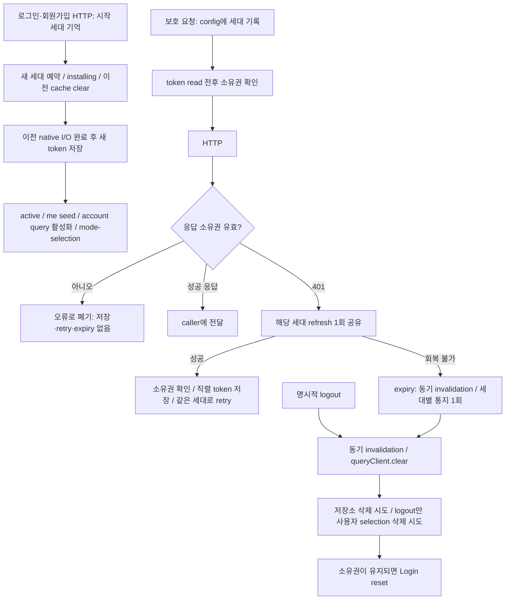

# R01 / R02 인증·세션 소유권 수정

작업 기준은 로컬 HEAD `2861023901c7dee25cdb80da9197a080ea740c57` (`R7랭킹갱신확장성 개선`)다. 시작 시 working tree는 clean이었다. 과거 감사 보고서와 현재 호출 경로를 대조했으며, 이 변경은 frontend에 한정한다. 아래 검증은 로컬 미커밋 변경에 대한 결과다.

## 1. 실제 원인과 조사 범위

**R01:** `client.ts`의 전역 refresh promise에는 세션 소유자가 없었다. 요청 config에도 발행 세션이 없어서 A 요청의 늦은 401이 현재 B 토큰으로 refresh를 시작할 수 있었다. 진행 중인 A refresh 성공은 `saveTokens`, 실패는 `clearTokens`와 expiry 통지를 실행했다. 응답 성공 경로도 이전 세션 응답을 그대로 caller에 넘겼다. Login/Signup의 `saveTokens → beginSession` 순서에는 새 토큰 설치 전에 이전 작업을 무효화하는 경계가 없었다.

세대 확인만 추가해도 **이미 native 저장소에 전달한 쓰기/삭제**는 취소할 수 없다. A의 지연된 native write가 B의 write보다 늦게 끝나는 경우까지 방지하려면 저장소 실행 순서도 제어해야 한다.

**R02:** client의 `clearTokens → notifySessionExpired`에서 삭제 실패가 통지를 막았고, `useLogout`의 refresh-token read는 try/finally 밖이었다. `endSession`의 token 삭제 실패는 뒤의 selection 정리와 호출자의 navigation을 막았다. 기존 `runSessionExpiryTeardown`의 cache-first/finally-navigation은 올바른 보호였지만 모든 실제 종료 경로가 이를 사용하지 않았다.

보고서 가설과 다른 점: 기존 `clearSelectedAccountId`는 이미 자체 catch로 실패를 삼켰다. 이 함수의 native remove reject 자체가 navigation을 중단시키지는 않았다. 이번에는 삭제 성공 여부를 boolean으로 반환하고 안전한 진단을 남겨, 삭제 실패를 성공으로 간주하지 않게 했다. 저장 key와 읽기/선택 정책은 유지했다.

확인한 호출 경로:

| 경로 | 확인 및 반영 |
| --- | --- |
| Login/Signup → auth API → install → cache seed → entry | HTTP 시작 소유권과 새 install 소유권을 연결. 저장 성공 후 `me`와 계정 list 활성화, 새 로그인은 mode-selection |
| 보호 API → request interceptor → 401 → refresh → retry | 요청 발행 세대, 저장소 await 전후 검사, 같은 세대 single-flight, retry에서도 원래 세대 유지 |
| My/Settings → useLogout | 현재 직접 클릭 callback에서 종료. 동기 invalidation/cache clear 후 저장소·revoke 처리 |
| refresh 실패 → sessionExpiry → AppProviders bridge | storage 삭제 전에 invalidation/통지. bridge가 공통 endSession 사용 |
| Splash restore → getMe → useEnterApp | bootstrap 소유권 확인으로 늦은 identity cache seed/navigation 차단 |
| SeasonJoin의 USER_NOT_ACTIVE | 직접 token 삭제를 소유권 있는 endSession으로 연결. 시즌 참가 로직/R03은 변경하지 않음 |
| realtime socket의 token read | 기존 getAccessToken 호출이 runtime invalidation 검사를 상속. WebSocket 구조 변경 없음 |
| logout-all | API 함수만 있고 실제 frontend UI 호출자가 없음. backend와 API 함수 계약 유지 |
| backend auth service/controller/guard | rotation, refresh-session revoke, 현재 User status/role 재검증 확인. 변경 불필요 |

## 2. 최종 session lifecycle

Cold start에서 handler가 없으면 ended-generation 통지를 pending으로 보관한다. 등록 후 한 번 전달하고, 새 install은 이전 pending을 지운다. ended 세대는 재통지할 수 없으며 새로운 install은 같은 userId라도 별도 세대다.

명시적 logout의 server revoke는 종료 세대에서 읽은 refresh token으로 best effort 실행한다. 읽기 실패나 network 실패가 local cleanup/navigation을 막지 않는다. HTTP 완료는 local 종료가 기다리지 않는다.

## 3. 구현 방법과 복잡성

- `sessionOwnership.ts`: 숫자 generation과 `restoring/installing/active/ended` runtime 상태. 세션 시작·종료는 첫 await 전에 소유권을 변경한다. 별도 store나 상태 머신 라이브러리는 없다.
- Axios config의 `_sessionGeneration`은 token read 이전에 붙고 retry에서도 유지한다. 성공/실패 응답 모두 소유권 검사 후 caller에 전달한다. 새 세션의 토큰으로 old request를 재실행하지 않는다.
- refresh flight는 `{ generation, promise }` 하나다. 같은 세대만 공유하고 이전 flight의 finally는 새 flight를 해제할 수 없다. 이미 같은 세대에서 회전이 끝난 늦은 401은 현재 토큰으로 retry한다.
- `runSessionStorage`는 token I/O와 logout selection 삭제를 직렬화하고 실행 전후 소유권을 검사한다. 새 install이 이전 native write/remove보다 뒤에 완료되도록 한다. 실패한 작업은 queue를 영구적으로 막지 않는다.
- `authenticateSession → beginSession`이 새 소유권 예약, token 저장, cache seed를 묶는다. 부분 multiSet 실패는 인증 성공이 아니다. runtime을 끝내고 정리를 시도하며 `me`를 seed하지 않는다.
- `endSession`은 cache를 동기적으로 비우고 기존 teardown helper를 재사용한다. token/selection storage 실패를 각각 처리하며, finally navigation에도 소유권을 검사한다. 중복 logout은 같은 종료 promise를 공유한다.
- `SessionCleanupResult`는 삭제가 확인되지 않으면 `tokensRemoved: false`, selection 실패는 `selectionRemoved: false`다. 로그에는 credential이나 native exception payload를 넣지 않는다.

새 infrastructure, dependency, persistence schema, cache authority, backend orchestration은 없다. 파일 크기 때문에 서비스를 분리하거나 기존 금융/계정 로직을 재작성하지 않았다.

## 4. 변경 파일

경로는 `frontend/` 기준이다.

| 파일 | 구분 | 역할/변경 이유 |
| --- | --- | --- |
| `src/services/api/sessionOwnership.ts` | 신규 | runtime 세대·활성 상태·소유권 오류·안전한 storage 진단 |
| `src/services/api/client.ts` | 수정 | 요청 세대, 성공/오류 폐기, 세대별 refresh 병합과 retry |
| `src/services/storage/tokenStorage.ts` | 수정 | native I/O 직렬화, token 사용 제한, 종료 세대 revoke용 read |
| `src/services/api/sessionExpiry.ts` | 수정 | 소유권 있는 pending 통지와 once-only invalidation |
| `src/features/auth/session.ts` | 수정 | install/종료 경계, 저장소 실패 처리, 공통 teardown |
| `src/features/auth/sessionTeardown.ts` | 수정 | 기존 cache/credentials/navigation 순서에 소유권 검사 추가 |
| `src/features/auth/useLogout.ts` | 수정 | refresh read를 공통 종료 경계 안으로 이동, best-effort revoke |
| `src/features/auth/api.ts` | 수정 | public login/signup/revoke가 기존 credential을 붙이거나 refresh하지 않도록 지정 |
| `src/features/auth/useEnterApp.ts` | 수정 | 계정/선택 read 이후 이전 세대 navigation 차단 |
| `src/features/tradingAccount/selectionStorage.ts` | 수정 | 삭제 결과 boolean과 안전한 진단. 사용자별 key 유지 |
| `src/app/AppProviders.tsx` | 수정 | expiry bridge가 세대를 전달하고 공통 endSession 사용 |
| `src/screens/auth/LoginScreen.tsx`, `SignupScreen.tsx` | 수정 | authenticateSession 사용, 늦은 인증 결과/navigation 차단 |
| `src/screens/auth/SplashScreen.tsx` | 수정 | 복원 세대 검사와 공통 종료 |
| `src/screens/season/SeasonJoinScreen.tsx` | 수정 | inactive 인증 오류에서만 직접 token 삭제 경로 교체 |
| `src/features/auth/sessionLifecycle.test.ts` | 신규 | 실제 interceptor/session과 storage 경쟁·실패·변형 검출 29 cases |
| `src/features/auth/authLifecycle.test.ts` | 신규 | 실제 화면 callback/hook/bridge/Splash 경계 10 cases |
| `test/sessionTestHarness.cjs` | 신규 | actual Axios/QueryClient/module 실행, 제어 가능한 transport/native storage |
| `src/services/api/sessionExpiry.test.ts` | 수정 | 새 session은 실제 새 세대라는 fixture를 사용, 기존 통지 기대 유지 |
| `src/components/states/ScreenErrorBoundary.test.ts` | 수정 | 변경된 bridge 종료 책임에 mock 연결, 기존 cache/navigation 기대 유지 |
| `package.json` | 수정 | 변경한 low-level client/ownership/tokenStorage를 기존 lint gate에 추가 |
| `docs/session-ownership/report.md`, `ci-evidence.json` | 신규 | 원인·검증·한계 및 조회한 hosted CI 증거 |

`sessionCache.ts`, 계정 선택 구조, 금융 API 동작은 변경하지 않았다.

## 5. backend/API/DB 영향

Backend 수정 없음. API 경로·request/response contract 변경 없음 (`/api/v1` 유지). DB/schema/migration/index 변경 없음. 저장 key·기존 데이터 migration 변경 없음. Axios의 ownership/public-auth 옵션은 내부 request metadata다. JWT/refresh-token rotation/revoke/TTL 정책을 변경하지 않았다.

## 6. 경쟁·실패 테스트 결과

실제 `client.ts` interceptors, session/expiry/storage 코드와 QueryClient를 실행한다. HTTP adapter, AsyncStorage, navigation/native host를 제어한 deterministic frontend integration harness이며, 실제 서버·기기·native 저장소 장애 시험으로 표현하지 않는다. 화면 테스트는 실제 화면의 mutation callbacks와 hook을 호출하고 React rendering/scheduling 일부는 mock한다.

| 조건 | 결과 |
| --- | --- |
| A refresh pending → logout → B login → A success | PASS: B 두 token/cache 유지, A 저장/retry/expiry/navigation 없음 |
| 같은 조건에서 A failure | PASS: B token/cache/navigation 보호 |
| B 설치 후 late A original 401 / 200 | PASS: 새 refresh 없음, old 응답 caller/cache 전달 차단 |
| 같은 세대 concurrent 401 6개 | PASS: refresh HTTP 1회, current credential retry 6회 |
| rotation 완료 후 같은 세대의 늦은 401 | PASS: 완료된 rotation 재사용 |
| A refresh pending 중 B 401 | PASS: B 별도 refresh, A finally가 B flight 해제하지 않음 |
| A → B → A | PASS: 같은 userId의 새 세대를 이전 A와 구별 |
| logout 확정 후 refresh completion | PASS: cache/논리 세션 즉시 종료, 부활/retry 없음 |
| 이미 시작한 A native write/delete 또는 selection delete | PASS: 새 install보다 뒤에 완료하지 못함; 새 세션 navigation 보호 |
| 초기 token read / retry token read 중 세션 변경 | PASS: old credential로 dispatch하지 않음 |
| logout getRefreshToken 실패 | PASS: revoke 생략 가능, cache/token/selection cleanup와 Login 완료 |
| clearTokens 실패 | PASS: runtime invalid, cache 없음, Login, token 재사용 없음; disk 값 잔존과 false 결과를 명시적으로 검증 |
| clearSelectedAccountId 실패 | PASS: token 삭제와 Login 완료, selection 잔존/false 결과 검증 |
| expiry + token remove 실패 | PASS: cache/Login 완료, once-only, stale token 차단 |
| 보호 요청 getAccessToken/getRefreshToken 실패 | PASS: expiry 한 번, teardown 완료 |
| login/refresh 부분 multiSet 실패 | PASS: 인증 cache 활성화 안 함, 종료·cleanup 시도 |
| server revoke pending/failure | PASS: local 종료를 기다리게 하지 않음 |
| cold start dead-token burst, handler 늦게 등록 | PASS: pending 한 번 전달; expiry는 selection 유지 |
| 새 login이 이전 pending expiry 대체 | PASS: B에게 이전 expiry 전달 없음 |
| cleanup 실패 뒤 B login 및 B expiry | PASS: queue/once-only 상태가 다음 세션을 막지 않음 |
| 실제 Login/Signup | PASS: 저장 전 query 비활성, 성공 후 account list 조회, mode-selection; 저장 실패 시 미활성 |
| 실제 useLogout / AppProviders bridge / Splash | PASS: 중복 reset 방지, storage 실패, 지연 cleanup/restore의 B 보호 |

**결함 탐지력:** harness가 읽은 source의 격리된 사본에만 변형을 주입했다. generation 비교를 제거하면 stale-success 시나리오의 assertion이 실패했다. token 삭제 실패 보호와 finally navigation을 제거하면 logout 시나리오 assertion이 실패했다. 두 변형 검출 테스트는 PASS이며 제품 소스를 잘못 바꿔 놓은 상태는 없다.

## 7. 저장소 실패의 정확한 보장 범위

- 종료 의도와 cache 제거는 storage보다 먼저 확정된다. storage promise가 reject해도 현재 runtime은 ended이며 보호 HTTP에 persisted stale token을 다시 붙이지 않고 Login으로 이동한다.
- login 저장 실패와 refresh 저장 실패를 성공으로 간주하지 않는다. login은 cache seed 없이 인증 시도를 실패시키고, refresh 실패는 해당 세션을 expiry 처리한다. 모두 가능한 token cleanup을 시도한다.
- **실제 AsyncStorage 삭제가 실패하면 disk의 물리적 삭제는 보장하지 않는다.** 테스트도 값이 남은 상태를 검증한다. runtime epoch는 영속 상태가 아니므로 앱 프로세스 재시작 뒤 남은 credential 복원을 원천 차단하는 새 tombstone은 도입하지 않았다. 서버의 기존 만료/revoke 정책은 그대로 적용된다.
- 이미 시작한 native I/O는 취소할 수 없으므로 새 install은 그 작업의 settle을 기다린다. 영원히 settle하지 않는 native I/O의 완료 시간이나 multi-runtime/browser-tab 간 소유권까지 보장하는 구조는 아니다. 현재 요구한 reject 실패와 단일 앱 runtime의 소유권 경계를 해결한다.
- Splash의 최초 token read 실패는 기존 retryable bootstrap 오류 정책을 유지한다. 보호 API interceptor에서 credential read가 실패한 경우는 계속 인증할 수 없으므로 expiry 처리한다.
- explicit logout은 selection 삭제를 시도하고, 자동 expiry는 동일 사용자의 재로그인을 위한 opaque selection pointer를 보존한다.

## 8. 기존 동작 회귀

전체 `queryClient.clear()` 유지, cache invalidate로 대체하지 않음. 새 로그인 seed 전에 이전 cache 제거. 사용자별 account key 유지. 새 로그인/회원가입은 stored selection을 자동 복원하지 않고 mode-selection 진입. 성공 시 `me` seed로 account query 활성화. session restore의 기존 선택 복원 정책 유지. expiry once-only/pending, 같은 세대 refresh single-flight, 신규 세대 refresh 재개 유지. 인증 오류를 금융 API 성공으로 변환하지 않는다.

## 9. 실행 검증과 hosted CI

명령 기준 디렉터리는 `frontend/`다 (`git diff --check`는 저장소 root).

| 명령 | 결과 |
| --- | --- |
| `npm run check` | PASS: accounts lint + guides lint + typecheck + 전체 tests |
| `npm run typecheck` | PASS (별도 실행 및 check 내부 실행) |
| `node src/features/auth/sessionLifecycle.test.ts` | PASS: 29 tests / 4 suites, mutation 검출 2개 포함 |
| `node src/features/auth/authLifecycle.test.ts` | PASS: 10 tests / 2 suites |
| `npm run test` (`check` 내부) | PASS: Node runner가 보고한 test file 87개, fail/skip 0 |
| `npm exec -- eslint --no-fix --max-warnings=0 src/screens/season/SeasonJoinScreen.tsx` | PASS: gate 밖의 수정 파일 추가 확인 |
| `npm run export:web` | PASS: Expo production web export, bundle 1.8 MB |
| `git diff --check` | PASS |

87은 `node --test`가 보고한 파일 단위 개수다. 신규 39개 개별 시나리오는 직접 실행 결과로 따로 확인했다. 기존 auth/session, sessionExpiry, session cache, account/entry 전환 테스트도 전체 check에 포함된다. 실제 iOS/Android 기기, 실제 AsyncStorage fault, 브라우저 자동화 로그인 E2E는 실행하지 않았다. backend 코드 변경이 없어 backend suite는 이번 로컬 작업에서 재실행하지 않았다.

기준 HEAD의 [GitHub Actions run #120](https://github.com/windowsjd/trading_app/actions/runs/35733340297)은 failure다. Frontend quality(검사·typecheck·tests·web export), Backend quality, Release-critical E2E, Core account PostgreSQL, Limit order PostgreSQL은 success. **Candle fixture integration의 release fixture smoke만 failure**다. 이는 별도 R10 경로이고 이번 수정에서 건드리지 않았다. 현재 변경은 push하지 않았으므로 이 변경에 대한 새 hosted CI 통과를 주장하지 않는다. 조회 결과는 `ci-evidence.json`에 기록했다.

## 10. 최종 자체 검토

기존 추론과 분리해 제품 소스, 신규 harness/tests, 모든 token install/clear·session begin/end·expiry 호출자를 다시 읽고 전체 tracked diff와 신규 파일을 검토했다. old 401/success/failure, native write 완료 순서, pending expiry, teardown 중 새 로그인, 동일 사용자 재로그인, retry 직전 token read를 확인했다.

변경은 frontend auth/session 소유권, 해당 호출부, 테스트·검증 문서·lint scope에 한정된다. backend/주문/환전/랭킹/시즌 참가 정책·UI 디자인 변경 없음. 기존 사용자 변경은 시작 시 없었으며 기존 기대값이나 cache/금융 정책을 완화하지 않았다. 전체 파일 rename/불필요한 포맷 변경, production test hook, 임시 debug code, 새 infrastructure/영구 상태 없음. 작은 runtime coordinator와 기존 helper 재사용으로 작업 범위를 유지했다.
